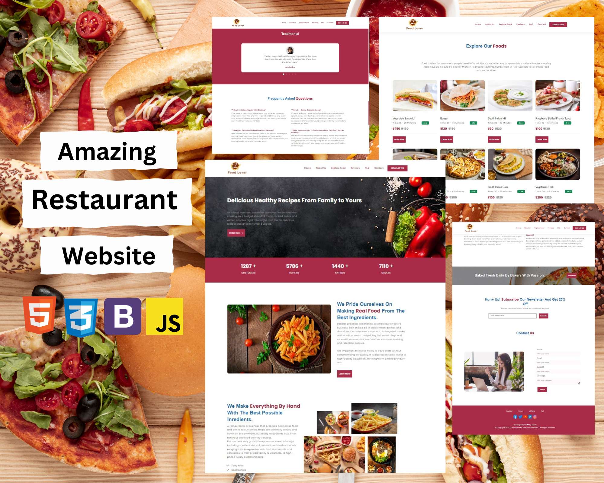

# Restaurant-Website

A landing page template for a restaurant.

## 📖 Description

This is a sample project for a restaurant to deliver its services via online website.
 
It consists of sections like home ,popular dishes, reviews, faq, contact ,finally about the restaurant and crew members of the restaurant followed by quick links of the page and social media links of the restaurant .

* A header section with the logo and navbar.
* A popular food type section.
* A fast food section.
* A customer testimonials and about the menu section.
* A mailing list subscribtion section.
* A contact section
* A footer section.
* Developed first with the Mobile First methodology, then for desktop.
* Compatible with all mobile devices and with a beautiful and pleasant user interface.

## 🛠 Built With

* HTML
* CSS
* BOOTSTRAP
* JAVASCRIPT